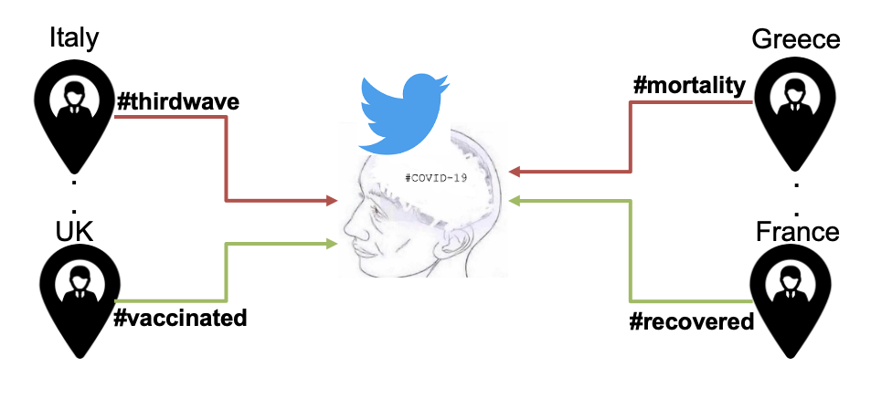
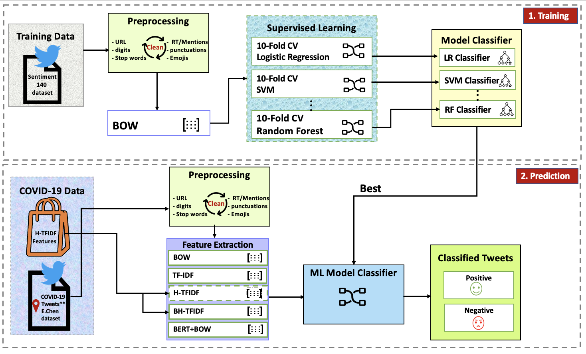

# Spatial Opinion Mining

## Training Dataset

The training dataset is the well-known kaggle Sentiment140 dataset for sentiment analysis of tweets for English language only. The dataset is available at: 

The dataset contains 1.6 million tweets, equally balanced between two classes. Tweets are being annotated as (0 = negative) and (4 = positive).

## Research Objectives

1) Spatial Opinion Mining

2) Feature Selection for Sentiment Analysis
 

## Sentiment Analysis

1) Sentiment analysis Notebook code is available at : 
2) Results Visualization Notebook code is available at : !(Venn Visualization)[Venn_Visualization_Results.ipynb]

## Results 

One can find the sentiment analysis results of prediction dataset at : 

